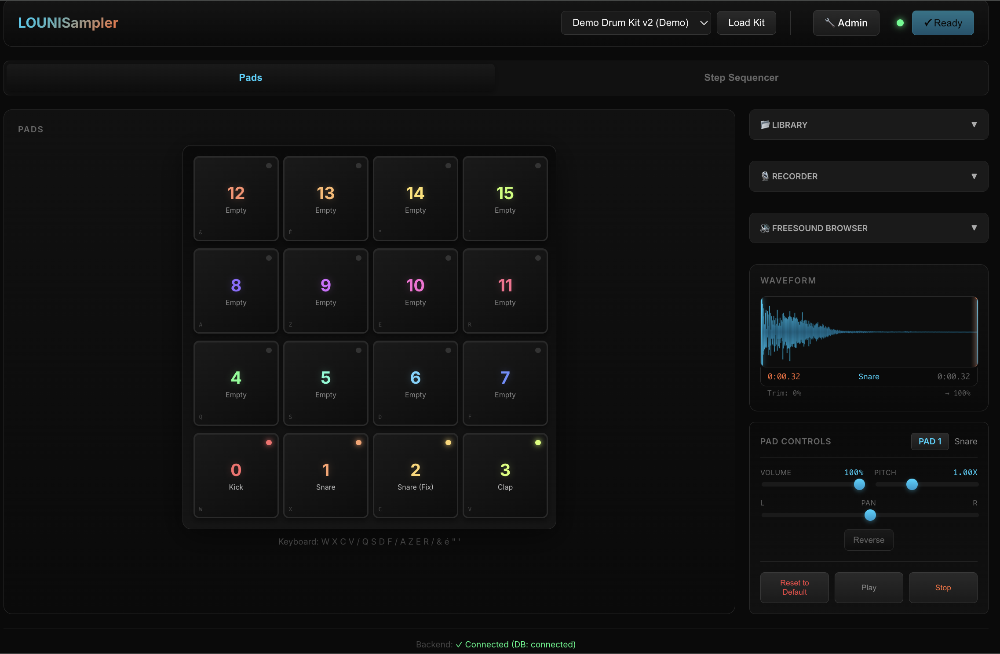
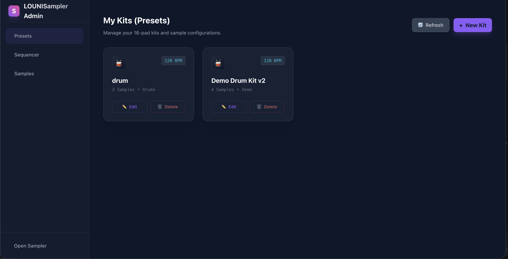

# LOUNISampler

**LOUNISampler** est un projet réalisé par **Elies LOUNIS** dans le cadre de l'UE "Web" de mon Master 1 Informatique à l'Université Côte d'Azur, sous la supervision de l'enseignant Michel BUFFA.




## Accès en Ligne

Vous pouvez tester le projet directement sur Render via les liens suivants :

*   **Logiciel Sampler** : [lounis-sampler.onrender.com](https://lounis-sampler.onrender.com)
*   **Panneau d'Administration** : [lounis-sampler-admin.onrender.com](https://lounis-sampler-admin.onrender.com)

*Note : Le premier chargement peut prendre quelques secondes (mise en route des services gratuits Render).*

## Fonctionnalités Clés

*   **16-Pad Drum Machine** : Pads réactifs avec retour visuel, optimisés pour les claviers AZERTY et QWERTY afin de garantir une jouabilité maximale.
*   **Contrôle Sonore Avancé** : Modifiez individuellement le volume, le pitch (vitesse de lecture) et le panoramique (pan) pour chaque sample.
*   **Séquenceur Pas à Pas** : Un séquenceur robuste de 16 pas avec contrôle du BPM, permettant la création de motifs complexes et l'édition en temps réel.
    
*   **Enregistrement Audio & Découpage** : Enregistrez de l'audio directement depuis votre microphone. Les découpes (slices) peuvent être glissées-déposées (drag and drop) directement sur les pads ou sauvegardées pour être réutilisées.
*   **Intégration Freesound** : Recherchez et téléchargez des samples directement depuis Freesound.org pour les utiliser dans l'application.
*   **Tableau de Bord Admin** : Un panneau d'administration complet basé sur Angular pour gérer les presets (Kits), les samples individuels et les motifs du séquenceur.
    
*   **Bibliothèque de Samples** : Gestion organisée de la bibliothèque pour un accès facile à vos sons.

## Stack Technique

Ce projet est un monorepo composé de trois composants principaux :

### 1. Frontend (Sampler) - `sampler-front/`
*   **Cœur** : Vanilla JavaScript (ES6+) avec Web Components pour une architecture modulaire.
*   **Audio** : Web Audio API pour la synthèse sonore et la lecture à faible latence.
*   **Style** : CSS personnalisé avec une esthétique sombre et moderne.
*   **Gestion d'État** : Architecture événementielle (Event-Driven).

### 2. Panneau Admin - `admin-angular/`
*   **Framework** : Angular 17+ (utilisant les Standalone Components).
*   **Style** : Tailwind CSS pour un développement d'interface rapide.
*   **Routage** : Angular Router pour une navigation fluide.

### 3. Backend - `backend/`
*   **Runtime** : Node.js.
*   **Framework** : Express.js pour les points de terminaison API RESTful.
*   **Base de Données** : MongoDB Atlas pour le stockage persistant des presets, des samples et des métadonnées.
*   **Gestion de Fichiers** : Multer pour la gestion des uploads de fichiers audio.

## Structure Détaillée du Projet

Voici une description détaillée de l'arborescence et de l'utilité de chaque fichier majeur.

### 1. sampler-front (Application Client Vanilla JS)

Cette partie gère l'interface utilisateur du sampler, la lecture audio, et l'interaction directe avec l'utilisateur.

*   `index.html` : Point d'entrée de l'application. Charge les styles et le script principal.
*   `src/styles/main.css` : Feuille de style globale définissant le thème sombre et les variables CSS.
*   `src/components/MySampler.js` : Composant racine (Web Component) qui orchestre tous les autres composants et gère l'état global.
*   `src/components/PadGrid.js` : Gère la grille de 16 pads, leur affichage et les interactions souris/tactiles.
*   `src/components/PadElement.js` : Représente un pad individuel, gère son animation et son déclenchement.
*   `src/components/ControlRack.js` : Panneau de contrôle pour modifier les paramètres du son (volume, pitch, pan, reverse) du pad sélectionné.
*   `src/components/WaveformDisplay.js` : Visualise la forme d'onde du sample sélectionné ou enregistré.
*   `src/components/StepSequencer.js` : Implémente le séquenceur pas à pas, gère la grille de temps et la lecture automatique des pads.
*   `src/components/RecorderPanel.js` : Gère l'enregistrement audio via le microphone et le découpage (slicing) du son enregistré.
*   `src/components/FreesoundBrowser.js` : Interface de recherche et d'importation de sons depuis l'API Freesound.
*   `src/components/SampleLibrary.js` : Affiche la bibliothèque de sons disponibles localement ou sur le serveur.
*   `src/audio/AudioEngine.js` : Moteur audio singleton utilisant la Web Audio API. Gère le chargement des buffers, la lecture, et le mixage.
*   `src/audio/AudioConstants.js` : Contient les constantes comme le mapping MIDI, les couleurs des pads et les configurations par défaut.

### 2. admin-angular (Tableau de Bord d'Administration)

Application Angular permettant à l'administrateur de gérer le contenu de l'application (presets, samples).

*   `src/main.ts` : Point d'entrée de l'application Angular.
*   `src/app/app.component.ts` : Composant racine, contient la structure de base et la navigation.
*   `src/app/app.routes.ts` : Définit les routes de l'application (presets, samples, sequenceur).
*   `src/app/features/presets/` : Module de gestion des kits de batterie (CRUD).
    *   `preset-list/` : Affiche la liste des kits existants.
    *   `preset-detail/` : Formulaire de création/édition d'un kit, avec upload de fichiers audio.
*   `src/app/features/samples/` : Module de gestion des samples individuels.
*   `src/app/features/sequencer/` : Module de gestion des motifs de séquenceur pré-enregistrés.
*   `src/app/services/` : Services pour communiquer avec le backend API.
    *   `preset.service.ts` : Appels API pour les presets.
    *   `sample.service.ts` : Appels API pour les samples.
*   `src/app/services/sequencer-preset.service.ts` : Appels API pour les séquences.

### 3. backend (Serveur API & Base de Données)

Serveur Node.js/Express qui sert les données et les fichiers statiques.

*   `server.js` : Point d'entrée du serveur. Initialise Express, la connexion MongoDB et les middlewares (CORS, body-parser).
*   `routes/` : Définition des endpoints API.
    *   `routes/presets.js` : Routes pour créer, lire, mettre à jour et supprimer les kits (presets).
    *   `routes/samples.js` : Routes pour la gestion des fichiers audio bruts.
    *   `routes/freesound.js` : Proxy pour les requêtes vers l'API externe Freesound.
    *   `routes/sequencer-presets.js` : Routes pour sauvegarder/charger les séquences.
*   `models/` : Schémas Mongoose définissant la structure des données dans MongoDB.
    *   `models/Preset.js` : Modèle de données pour un kit complet.
*   `public/uploads/` : Dossier où sont stockés physiquement les fichiers audio uploadés.

## Assistance IA & Développement

Ce projet a été développé avec l'aide de modèles d'IA avancés :

*   **Gemini 3 Pro** : Utilisé pour la planification de haut niveau du projet, la conception architecturale et la conceptualisation UI/UX.
*   **Claude Opus 4.5** : Utilisé pour l'exécution de l'implémentation logique complexe (Séquenceur, Audio Engine).

## Démarrage

Suivez ces étapes pour lancer le projet localement.

### Prérequis
*   **Node.js** (v18 ou supérieur)
*   **Compte MongoDB Atlas**
*   **Clé API Freesound**

### Installation

1.  **Clonage du dépôt :**
    ```bash
    git clone https://github.com/votre-username/LOUNISampler.git
    cd LOUNISampler
    ```

2.  **Configuration du Backend :**
    ```bash
    cd backend
    npm install
    # Créez un fichier .env (MONGODB_URI, FREESOUND_API_KEY)
    npm start
    ```
    *Le serveur backend démarrera sur le port 3000.*

3.  **Configuration du Panneau Admin :**
    ```bash
    cd admin-angular
    npm install
    npm start
    ```
    *Le tableau de bord admin sera disponible à l'adresse http://localhost:4200.*

4.  **Lancement du Frontend Sampler :**
    *   Ouvrez `sampler-front/index.html` avec **Live Server**.
    *   *Le sampler s'ouvrira à l'adresse http://localhost:5500.*

## Raccourcis Clavier (Configuration AZERTY)

*   **Pads 12-15** : `&`, `é`, `"`, `'`
*   **Pads 8-11** : `A`, `Z`, `E`, `R`
*   **Pads 4-7** : `Q`, `S`, `D`, `F`
*   **Pads 0-3** : `W`, `X`, `C`, `V`

---
*Réalisé par Elies LOUNIS pour le projet de Master 1 Info.*
